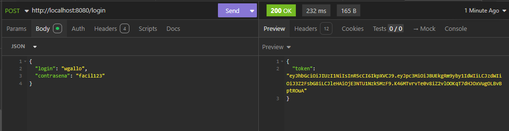
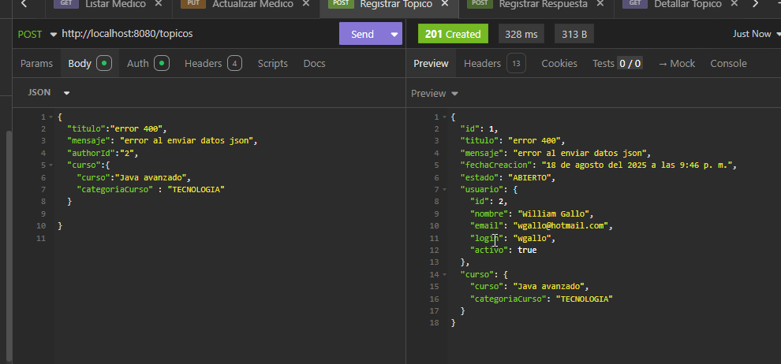
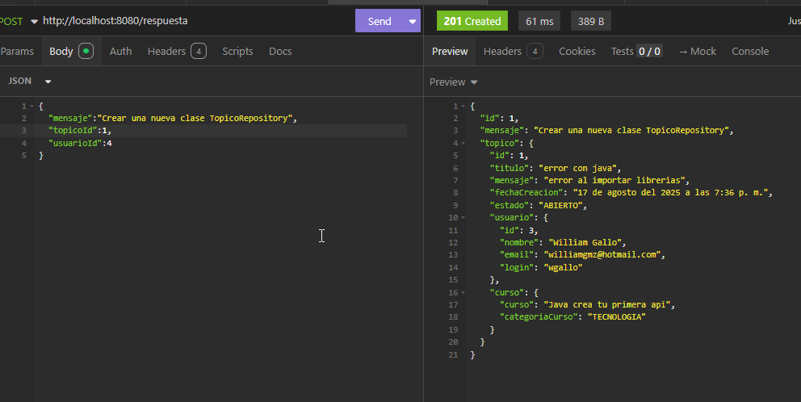
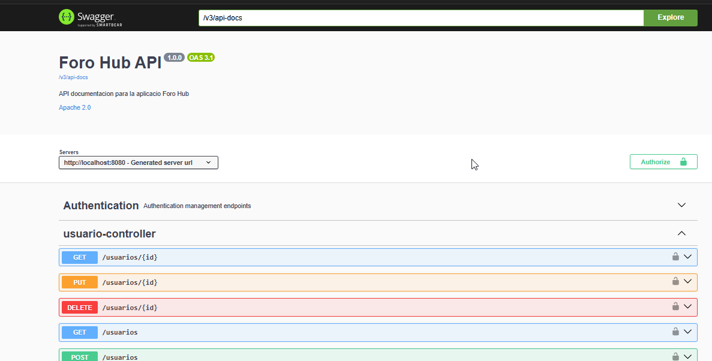
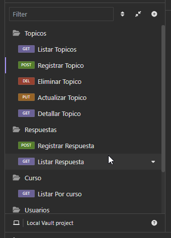
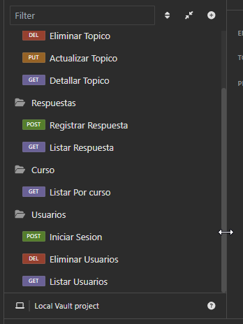

# Foro Hub - API REST
   <p align="left">
   
   </p>

Foro Hub es una aplicación de foro desarrollada con Spring Boot que permite a los usuarios crear, leer, actualizar y eliminar tópicos de discusión, así como interactuar con respuestas.

## 🚀 Tecnologías Utilizadas

- **Java 17**
- **Spring Boot 3.5.4**
- **Spring Security**
- **JWT (JSON Web Tokens)**
- **Spring Data JPA**
- **MySQL**
- **Flyway** (para migraciones de base de datos)
- **Lombok**
- **SpringDoc OpenAPI** (Documentación de la API)
- **Maven** (Gestión de dependencias)

## 🔐 Autenticación y Seguridad

La API utiliza JWT (JSON Web Tokens) para la autenticación. Para acceder a los endpoints protegidos, se debe incluir el token JWT en el encabezado `Authorization` de la siguiente manera:

```
Authorization: Bearer <token_jwt>
```

## 📚 Documentación de la API

La documentación interactiva de la API está disponible a través de Swagger UI:

- **Swagger UI**: `http://localhost:8080/swagger-ui.html`
- **OpenAPI JSON**: `http://localhost:8080/v3/api-docs`

## 🛠️ Endpoints

### Autenticación (`/login`)

| Método | Endpoint | Descripción | Autenticación Requerida |
|--------|----------|-------------|-------------------------|
| POST   | /login   | Autentica un usuario y devuelve un token JWT | No |

### Tópicos (`/topicos`)

| Método | Endpoint | Descripción | Autenticación Requerida |
|--------|----------|-------------|-------------------------|
| GET    | /topicos | Lista todos los tópicos | Si |
| POST   | /topicos | Crea un nuevo tópico | Sí |
| GET    | /topicos/{id} | Obtiene un tópico por su ID | Si |
| GET    | /topicos/{id} | Obtiene un tópico por su curso | Si |
| PUT    | /topicos/{id} | Actualiza un tópico existente | Sí (solo propietario o admin) |
| DELETE | /topicos/{id} | Elimina un tópico (marcado como inactivo) | Sí (solo propietario o admin) |

### Usuarios (`/usuarios`)

| Método | Endpoint | Descripción | Autenticación Requerida |
|--------|----------|-------------|-------------------------|
| GET    | /usuarios | Lista todos los usuarios | Sí (solo admin) |
| POST   | /usuarios | Registra un nuevo usuario | Si |
| GET    | /usuarios/{id} | Obtiene un usuario por su ID | Sí (solo propio usuario o admin) |
| PUT    | /usuarios/{id} | Actualiza un usuario existente | Sí (solo propio usuario o admin) |
| DELETE | /usuarios/{id} | Desactiva un usuario | Sí (solo admin) |

### Respuestas (`/respuestas`)

| Método | Endpoint | Descripción | Autenticación Requerida |
|--------|----------|-------------|-------------------------|
| POST   | /respuestas | Crea una nueva respuesta | Sí |
| GET    | /respuestas/topico/{id} | Obtiene respuestas por ID de tópico | Si |

## 🚀 Cómo Ejecutar el Proyecto

### Requisitos Previos

- Java 17 o superior
- MySQL 8.0 o superior
- Maven 3.6 o superior

### Pasos para la Ejecución

1. **Clonar el repositorio**:
   ```bash
   git clone https://github.com/tu-usuario/foro-hub.git
   cd foro-hub
   ```

2. **Configurar la base de datos**:
   - Crear una base de datos MySQL llamada `foro_hub`
   - Configurar las credenciales en `src/main/resources/application.properties`

3. **Compilar y ejecutar**:
   ```bash
   mvn clean install
   mvn spring-boot:run
   ```

4. **Acceder a la aplicación**:
   - API: `http://localhost:8080`
   - Swagger UI: `http://localhost:8080/swagger-ui.html`

## 🔧 Configuración

El archivo `application.properties` contiene las configuraciones principales:

```properties
# Configuración de la base de datos
spring.datasource.url=jdbc:mysql://localhost/foro_hub
spring.datasource.username=tu_usuario
spring.datasource.password=tu_contraseña

# Configuración de JWT
api.security.token.secret=tu_clave_secreta_jwt

# Configuración de Swagger/OpenAPI
springdoc.api-docs.path=/v3/api-docs
```

## 🔄 Ejemplos de JSON para Testing

### 1. Autenticación

**Login** `POST /login`
```json
{
  "login": "usuario@ejemplo.com",
  "contrasena": "tuContraseña123"
}
```

### 2. Usuarios

**Registrar Usuario** `POST /usuarios`
```json
{
  "nombre": "Juan Pérez",
  "password": "contraseñaSegura123",
  "login": "juan.perez",
  "email": "juan@ejemplo.com"
}
```

**Actualizar Usuario** `PUT /usuarios/{id}`
```json
{
  "nombre": "Juan Pérez Actualizado",
  "password": "nuevaContraseña123",
  "perfil": "ROLE_USER", 
   "activo": 0
}
```

### 3. Tópicos

**Crear Tópico** `POST /topicos`
```json
{
  "titulo": "Duda sobre Spring Boot",
  "mensaje": "Tengo una duda sobre la configuración de seguridad en Spring Boot...",
  "authorId": "juan@ejemplo.com",
  "curso": {
    "curso": "Spring Boot 3",
    "categoriaCurso": "PROGRAMACION"
  }
}
```

**Actualizar Tópico** `PUT /topicos/{id}`
```json
{
  "id": 1,
  "mensaje": "Mensaje actualizado con más detalles...",
  "estado": "CERRADO",
  "curso": {
    "curso": "Spring Boot 3 Avanzado",
    "categoriaCurso": "PROGRAMACION"
  }
}
```

### 4. Respuestas

**Crear Respuesta** `POST /respuestas`
```json
{
  "mensaje": "Aquí está mi respuesta a tu pregunta...",
  "topicoId": 1,
  "usuarioId": 1
}
```

**Actualizar Respuesta** `PUT /respuestas/{id}`
```json
{
  "mensaje": "Respuesta actualizada con más información..."
}
```


## 📝 Ejemplos



<br>



<br>



<br>




<br>






## 📝 Notas Adicionales

- La aplicación utiliza migraciones con Flyway para mantener la estructura de la base de datos.
- Los usuarios inactivos no pueden iniciar sesión.
- Las contraseñas se almacenan de forma segura usando BCrypt.
- Los tokens JWT tienen una duración limitada (configurable).

## 📄 Licencia

Este proyecto está bajo la Licencia MIT. Ver el archivo `LICENSE` para más detalles.
